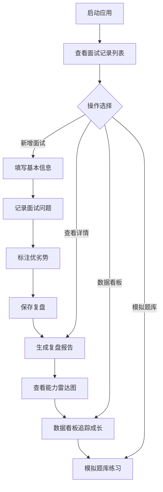

## 1. 产品概述

面试复盘助手是一款面向求职者的H5网页工具，帮助用户系统性记录每一场面试，自动生成多维度复盘分析与能力评估，通过数据看板追踪成长轨迹，内置模拟题库与学习资源，让每一次面试都转化为可见的成长。

- 目标用户：正在求职的应届生、社招跳槽者、面试准备者
- 解决痛点：面试后缺乏系统复盘、能力短板不清晰、成长无数据支撑、求职进度难管理
- 产品价值：将面试经验数据化、将能力成长可视化、将求职过程科学化

## 2. 核心功能

### 2.1 用户角色

| 角色 | 注册方式 | 核心权限 |
|------|----------|----------|
| 普通用户 | 无需注册，本地存储 | 记录面试、查看分析、使用题库、导出数据 |

### 2.2 功能模块

1. **面试记录首页**：面试列表展示、快速搜索筛选、求职进度概览
2. **新增/编辑面试**：结构化表单、语音速记、面试问题动态添加
3. **面试详情与复盘报告**：能力雷达图、优劣势总结、改进建议清单
4. **数据看板**：核心指标统计、通过率趋势图、能力成长对比、高频问题分析
5. **模拟面试题库**：分类题库、语音自测、自定义题库
6. **成长日记**：时间轴展示、求职心情记录、成长轨迹可视化
7. **个人中心**：求职状态设置、数据导出、通知提醒、隐私设置

### 2.3 页面详情

| 页面名称 | 模块名称 | 功能描述 |
|-----------|-------------|---------------------|
| 面试记录首页 | 顶部概览卡 | 显示求职状态、面试总数、最近面试时间 |
| 面试记录首页 | 搜索筛选栏 | 按公司、岗位、结果、时间筛选面试记录 |
| 面试记录首页 | 面试记录列表 | 卡片式展示，显示公司、岗位、轮次、结果、评分 |
| 面试记录首页 | 悬浮新增按钮 | 右下角醒目按钮，快速进入新增面试 |
| 新增/编辑面试 | 基本信息区 | 公司、岗位、轮次、时间、方式、面试官角色、结果 |
| 新增/编辑面试 | 面试过程区 | 时长、问题列表动态添加、心情选择 |
| 新增/编辑面试 | 复盘分析区 | 优势点、不足点、待改进项标签选择 |
| 新增/编辑面试 | 语音速记 | 录音转文字填充表单 |
| 面试详情 | 顶部概览 | 公司、岗位、时间、结果、星级评分 |
| 面试详情 | 能力雷达图 | 技术、沟通、逻辑、项目、抗压能力可视化 |
| 面试详情 | 优劣势总结 | 自动生成的优势与不足分析 |
| 面试详情 | 问题回顾 | 折叠展示每个问题及回答 |
| 面试详情 | 改进建议 | 基于不足点的学习资源推荐 |
| 数据看板 | 核心指标卡 | 总面试数、通过率、平均评分、待面试数 |
| 数据看板 | 通过率趋势 | 折线图展示近10次面试变化 |
| 数据看板 | 能力雷达对比 | 最早5次与最近5次能力对比 |
| 数据看板 | 分布统计 | 公司分布、轮次分布饼图 |
| 数据看板 | 高频问题 | Top10高频问题词云/列表 |
| 数据看板 | 心情趋势 | 面试感受变化曲线 |
| 模拟题库 | 分类导航 | 按岗位、题型分类筛选 |
| 模拟题库 | 题目卡片 | 题目内容、参考答案折叠、标签 |
| 模拟题库 | 模拟模式 | 随机出题、语音回答、回放自评 |
| 模拟题库 | 自定义题库 | 用户添加真题、标注重要性 |
| 成长日记 | 时间轴 | 面试历程时间轴展示 |
| 成长日记 | 心情日记 | 纯文本求职心情记录 |
| 个人中心 | 求职状态 | 积极寻找/观望中/已入职 |
| 个人中心 | 数据导出 | JSON/PDF格式导出 |
| 个人中心 | 设置 | 语音开关、提醒设置、隐私设置 |

## 3. 核心流程

### 3.1 主要用户流程

用户启动应用 → 查看面试记录列表 → 点击新增面试 → 填写基本信息 → 记录面试问题与回答 → 标注优劣势与改进点 → 保存生成复盘报告 → 查看能力雷达图与分析建议 → 在数据看板追踪成长轨迹 → 使用模拟题库练习薄弱环节

## 4. 用户界面设计

### 4.1 设计风格

- **主色调**：沉稳蓝 `#165DFF` 搭配活力橙 `#FF7D00`，体现专业与成长感
- **辅助色**：成功绿 `#00B42A`、待定金 `#FF7D00`、未通过灰 `#86909C`
- **背景色**：渐变蓝白背景，柔和弥散光影效果
- **卡片风格**：轻拟物卡片，圆角16px，细腻阴影，悬停微浮起效果
- **按钮风格**：主按钮圆角24px，渐变填充，点击有按压动效
- **字体**：标题使用 "Noto Sans SC" 600，正文使用 "PingFang SC" 400，数字等宽字体
- **图标**：Lucide 线性图标，统一24px尺寸，主色调填充
- **动效**：页面切换滑动过渡，雷达图从0扩展动画，卡片入场渐显

### 4.2 页面设计概述

| 页面名称 | 模块名称 | UI元素 |
|-----------|-------------|-------------|
| 面试记录首页 | 顶部概览卡 | 蓝白渐变背景，大数字显示面试场次，橙色进度条 |
| 面试记录首页 | 搜索筛选栏 | 圆角输入框，标签式筛选按钮，横向滚动 |
| 面试记录首页 | 面试记录列表 | 卡片式布局，左公司信息右结果标签，星级评分展示 |
| 新增/编辑面试 | 表单区域 | 分组卡片，标签式输入，动态添加按钮 |
| 新增/编辑面试 | 语音按钮 | 圆形悬浮录音按钮，呼吸动效指示录音状态 |
| 面试详情 | 雷达图区域 | 六边形雷达图，橙色渐变填充，动画展开 |
| 面试详情 | 优劣势标签 | 绿色优势标签、灰色不足标签，带图标 |
| 数据看板 | 指标卡片 | 四宫格布局，每个卡片带图标和趋势箭头 |
| 数据看板 | 图表区域 | 折线图、饼图、雷达图，统一配色体系 |
| 模拟题库 | 题目卡片 | 折叠式设计，答案区域渐显展开 |
| 成长日记 | 时间轴 | 左侧竖线，节点圆形标记，卡片错落布局 |
| 底部导航 | 导航栏 | 四个Tab：记录、成长、题库、我的，图标+文字 |

### 4.3 响应式设计

- **移动端优先**：以375px宽度为基准设计，弹性布局适配375-414px
- **平板适配**：iPad竖屏显示双列卡片，增加内容展示密度
- **触摸优化**：按钮最小44px点击区域，表单元素8px垂直间距
- **虚拟滚动**：面试记录超过50条时启用虚拟滚动优化性能
- **图片懒加载**：所有外部图片使用懒加载，占位骨架屏

### 4.4 数据可视化指导

- **雷达图**：使用Chart.js，6个能力维度（技术能力、沟通表达、逻辑思维、项目经验、抗压能力、岗位匹配），数值范围0-100
- **折线图**：通过率趋势、心情趋势，使用渐变填充区域
- **饼图**：面试轮次分布、公司行业分布，带图例与百分比
- **词云**：高频问题Top10，文字大小对应出现频率
- **动画**：所有图表数据加载时使用缓动动画，时长800ms
