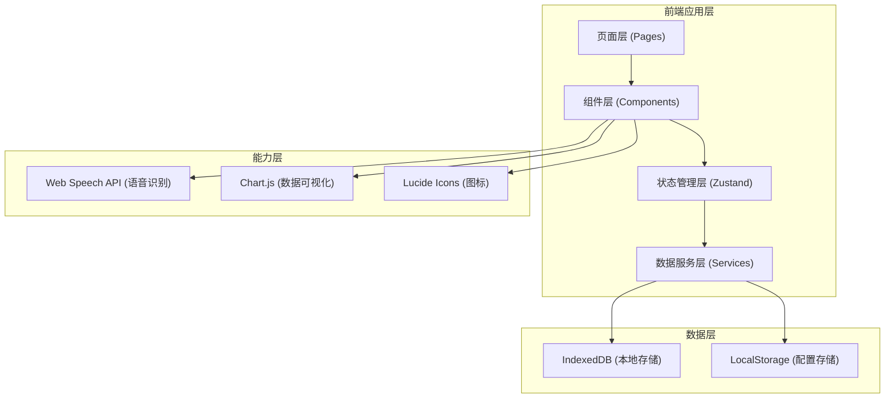
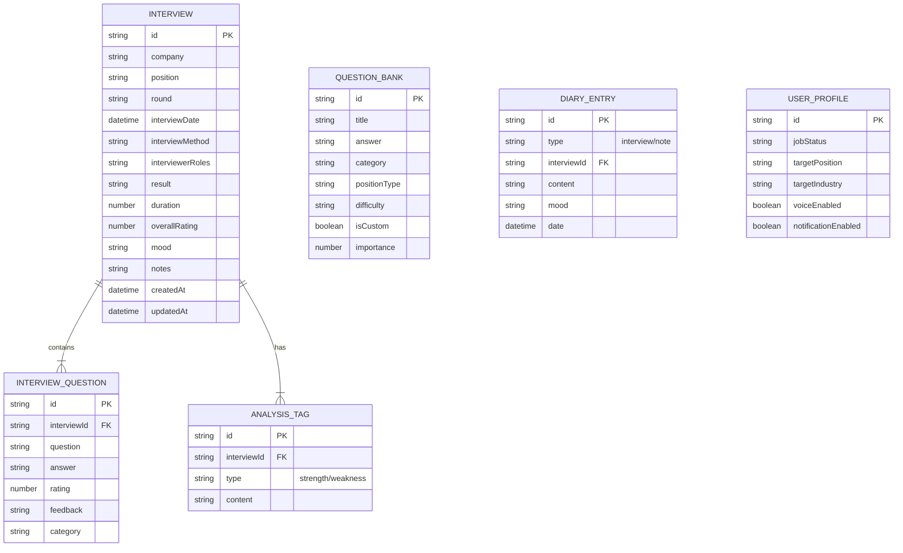

## 1. 架构设计



## 2. 技术描述

- **前端框架**：React@18 + TypeScript + Vite
- **初始化工具**：vite-init（react-ts模板）
- **状态管理**：Zustand（轻量级状态管理）
- **样式方案**：TailwindCSS@3 + 自定义CSS变量
- **路由管理**：React Router DOM v6
- **图标库**：Lucide React
- **数据可视化**：Chart.js + react-chartjs-2
- **本地存储**：IndexedDB（idb封装）+ LocalStorage
- **语音功能**：Web Speech API（浏览器原生）
- **后端**：无（纯前端H5应用）
- **数据加密**：AES加密敏感数据（可选）

## 3. 项目结构

```
src/
├── components/          # 通用组件
│   ├── layout/         # 布局组件（BottomNav, Header等）
│   ├── ui/             # 基础UI组件（Button, Card, Input等）
│   ├── interview/      # 面试相关组件
│   ├── charts/         # 图表组件
│   └── features/       # 业务功能组件
├── pages/              # 页面组件
│   ├── Home.tsx        # 面试记录首页
│   ├── InterviewForm.tsx    # 新增/编辑面试
│   ├── InterviewDetail.tsx  # 面试详情
│   ├── Dashboard.tsx   # 数据看板
│   ├── QuestionBank.tsx     # 模拟题库
│   ├── Diary.tsx       # 成长日记
│   └── Profile.tsx     # 个人中心
├── hooks/              # 自定义Hooks
│   ├── useIndexedDB.ts      # IndexedDB操作
│   ├── useSpeechRecognition.ts  # 语音识别
│   └── useInterviewAnalysis.ts   # 面试分析逻辑
├── store/              # Zustand状态管理
│   ├── interviewStore.ts     # 面试数据store
│   ├── questionStore.ts      # 题库store
│   └── profileStore.ts       # 用户配置store
├── services/           # 数据服务层
│   ├── interviewService.ts   # 面试CRUD服务
│   ├── questionService.ts    # 题库服务
│   └── exportService.ts      # 数据导出服务
├── types/              # TypeScript类型定义
│   ├── interview.ts    # 面试相关类型
│   ├── question.ts     # 题库相关类型
│   └── profile.ts      # 用户配置类型
├── utils/              # 工具函数
│   ├── analysis.ts     # 分析计算工具
│   ├── date.ts         # 日期处理
│   ├── storage.ts      # 存储工具
│   └── mock.ts         # Mock数据生成
├── data/               # 静态数据
│   ├── questions.ts    # 预设面试题库
│   └── tags.ts         # 标签配置数据
├── App.tsx             # 根组件
├── main.tsx            # 入口文件
└── index.css           # 全局样式与Tailwind配置
```

## 4. 路由定义

| 路由路径 | 页面组件 | 页面用途 |
|----------|----------|----------|
| `/` | Home | 面试记录首页 |
| `/interview/new` | InterviewForm | 新增面试复盘 |
| `/interview/edit/:id` | InterviewForm | 编辑面试复盘 |
| `/interview/:id` | InterviewDetail | 面试详情与复盘报告 |
| `/dashboard` | Dashboard | 数据看板与成长分析 |
| `/questions` | QuestionBank | 模拟面试题库 |
| `/diary` | Diary | 成长日记时间轴 |
| `/profile` | Profile | 个人中心与设置 |

## 5. 数据模型

### 5.1 数据模型ER图



### 5.2 TypeScript类型定义

```typescript
// types/interview.ts
export type InterviewResult = 'pass' | 'pending' | 'fail';
export type InterviewMethod = 'onsite' | 'phone' | 'video';
export type InterviewerRole = 'hr' | 'tech' | 'manager';
export type MoodType = 'good' | 'neutral' | 'bad';
export type TagType = 'strength' | 'weakness';

export interface InterviewQuestion {
  id: string;
  question: string;
  answer: string;
  rating: number; // 1-5
  feedback: string;
  category: string;
}

export interface AnalysisTag {
  id: string;
  type: TagType;
  content: string;
}

export interface Interview {
  id: string;
  company: string;
  position: string;
  round: string;
  interviewDate: string;
  interviewMethod: InterviewMethod;
  interviewerRoles: InterviewerRole[];
  result: InterviewResult;
  duration: number; // minutes
  overallRating: number; // 1-5
  mood: MoodType;
  notes: string;
  questions: InterviewQuestion[];
  strengths: AnalysisTag[];
  weaknesses: AnalysisTag[];
  improvements: string;
  createdAt: string;
  updatedAt: string;
}

export interface AbilityScores {
  technical: number;
  communication: number;
  logic: number;
  project: number;
  pressure: number;
  match: number;
}

// types/question.ts
export type QuestionCategory = 'behavior' | 'technical' | 'hr' | 'case';
export type PositionType = 'frontend' | 'backend' | 'product' | 'operation' | 'design';
export type DifficultyLevel = 'easy' | 'medium' | 'hard';

export interface Question {
  id: string;
  title: string;
  answer: string;
  category: QuestionCategory;
  positionType: PositionType;
  difficulty: DifficultyLevel;
  isCustom: boolean;
  importance: number; // 1-5
  tags: string[];
}

// types/profile.ts
export type JobStatus = 'actively_looking' | 'watching' | 'hired';

export interface UserProfile {
  id: string;
  jobStatus: JobStatus;
  targetPosition: string;
  targetIndustry: string;
  voiceEnabled: boolean;
  notificationEnabled: boolean;
  lastInterviewDate: string | null;
}
```

### 5.3 IndexedDB数据库结构

```typescript
// 数据库名与版本
const DB_NAME = 'InterviewAssistantDB';
const DB_VERSION = 1;

// Object Stores配置
const stores = [
  {
    name: 'interviews',
    keyPath: 'id',
    indexes: [
      { name: 'company', keyPath: 'company', unique: false },
      { name: 'position', keyPath: 'position', unique: false },
      { name: 'result', keyPath: 'result', unique: false },
      { name: 'interviewDate', keyPath: 'interviewDate', unique: false },
      { name: 'createdAt', keyPath: 'createdAt', unique: false }
    ]
  },
  {
    name: 'questions',
    keyPath: 'id',
    indexes: [
      { name: 'category', keyPath: 'category', unique: false },
      { name: 'positionType', keyPath: 'positionType', unique: false },
      { name: 'isCustom', keyPath: 'isCustom', unique: false }
    ]
  },
  {
    name: 'diary',
    keyPath: 'id',
    indexes: [
      { name: 'date', keyPath: 'date', unique: false },
      { name: 'type', keyPath: 'type', unique: false }
    ]
  },
  {
    name: 'profile',
    keyPath: 'id'
  }
];
```

## 6. 核心算法与分析逻辑

### 6.1 能力评分映射规则

根据面试问题评分和标签，自动计算各维度能力得分：

| 能力维度 | 映射规则 |
|----------|----------|
| 技术能力 | 技术类问题的平均评分 × 20 |
| 沟通表达 | 整体评分 + 沟通相关标签加成 |
| 逻辑思维 | 问题回答逻辑性评分 + 案例分析表现 |
| 项目经验 | 项目相关问题评分 × 20 |
| 抗压能力 | 压力问题表现 + 面试官反馈 |
| 岗位匹配 | 岗位相关问题评分 + 整体匹配度 |

### 6.2 复盘分析生成规则

基于标签和评分，使用规则匹配生成分析建议：

```typescript
// 优势标签 -> 分析文案
const strengthAnalysis: Record<string, string> = {
  '项目经验匹配': '你的项目经验与岗位需求高度匹配，能够清晰地阐述项目中的技术选型与难点攻克，这是你的核心优势。',
  '沟通流畅': '沟通表达能力优秀，回答问题条理清晰，能够准确理解面试官意图并给出恰当回应。',
  '技术基础扎实': '技术基础扎实，对核心概念理解深入，能够举一反三，展现了良好的技术素养。',
  // ...更多映射
};

// 不足标签 -> 改进建议
const weaknessSuggestions: Record<string, string[]> = {
  '算法题不熟': ['建议每天刷2-3道LeetCode中等题', '重点关注动态规划、树、链表等高频考点', '可以尝试「算法面试题汇总」专项练习'],
  '紧张': ['面试前可进行深呼吸放松', '多进行模拟面试练习', '准备充分可以有效缓解紧张情绪'],
  // ...更多映射
};
```

## 7. 性能优化策略

1. **虚拟滚动**：面试记录列表使用 `react-window` 实现虚拟滚动，支持1000+条记录流畅渲染
2. **代码分割**：按页面进行路由级代码分割，减少首屏加载体积
3. **懒加载**：图表组件、语音模块等非核心功能使用动态导入
4. **缓存策略**：IndexedDB数据查询结果使用内存缓存，避免重复查询
5. **防抖节流**：搜索输入、语音识别结果处理使用防抖优化
6. **PWA支持**：配置Service Worker实现离线访问和资源缓存

## 8. 兼容性策略

- **浏览器兼容**：Chrome 90+、Safari 14+、微信内置浏览器、主流手机浏览器
- **语音功能降级**：不支持Web Speech API的浏览器隐藏语音按钮
- **IndexedDB降级**：IndexedDB不可用时降级到LocalStorage（数据量受限提示）
- **CSS特性降级**：使用PostCSS autoprefixer处理CSS兼容性，关键样式提供fallback方案
